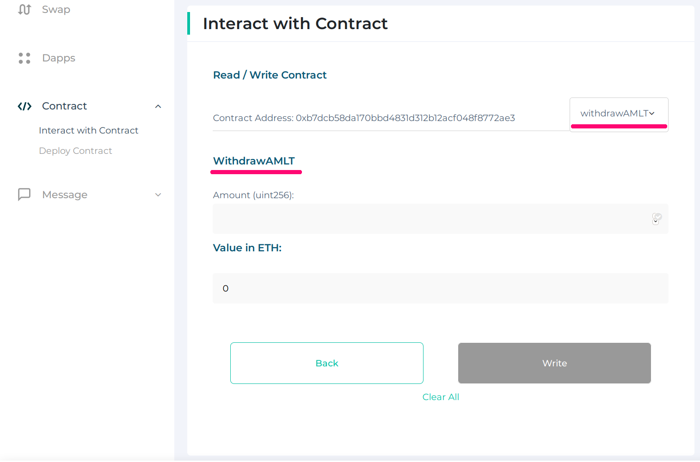

# How to interact with Coinfirm AML Oracles

## Eth Oracle 

    address: 0x288ff9d5645bb3d246bc0b678621272aec17f9fb

### Using MEW

* enter the [MEW](https://www.myetherwallet.com) website
* create new or access existing wallet 
* add new contract to interact with, set provided `address` and `abi`(content from `eth-oracle.abi`) to relevant placeholders 
* click `Continue`
* on the right side from contract address, choose 'depositETH' from drop-down menu and set desired amount to deposit (minimal fee for a report 0.001 ETH) 
* click `write` and continue with wallet you have signed in; If transaction executes successfully -- your deposit balance will be increased;
* to get default fee choose `getDefaultFee` from drop down menu and copy `Result` value. This is read call, no transaction to be sent 
* next send `askAMLStatus` function, set `maxFee` to value of maximum fee intended to pay for report, has to be greater or equal `default fee` (result from previous point)
 set `target` to the address you want to request AML report generation for; ATTENTION set `Value in ETH field` to ZERO! 
  
* click `write` and continue with wallet you have signed in; After successful transaction, our platform will generate AML report for the address and set result into blockchain with special transaction. This process is asynchronous, hence client should wait some time;
* next step is to fetch aml status. Choose 'fetchAMLStatus' from drop-down menu and set target to the address you used in previous step. Click write and proceed with the wallet you have signed in;

* to check deposit ETH balance -- choose `balanceOf` from drop down menu, enter your address in `Account(address) field then click `Read`, the result will appear. This is read call, no transaction to be sent. 

* to withdraw your depositet ETH, choose `withdrawETH` from drop-down menu, and enter amount to be withdrawn, after click write, and proceed with wallet you have signed in. 

## AMLT Oracle

    address: 0xb7dcb58da170bbd4831d312b12acf048f8772ae3

### Using MEW

* enter the [MEW](https://www.myetherwallet.com) website
* create new or access existing wallet 
* add new contract to interact with, set provided amlt-oracle `address` and `abi`(content from `amlt-oracle.abi`) to relevant placeholders 
* on the right side from contract address, choose 'depositAMLT' from drop-down menu and set desired amount to deposit (minimal fee for a report 1 AMLT) 
* click `write` and continue with wallet you have signed in; If transaction executes successfully -- your deposit balance will be increased;
* to get default fee choose `getDefaultFee` from drop down menu and copy `Result` value. This is read call, no transaction to be sent 
* next send `askAMLStatus` function, set `maxFee` to value of maximum fee intended to pay for report, has to be greater or equal `default fee` (result from previous point)
 set `target` to the address you want to request AML report generation for; ATTENTION set `Value in ETH field` to ZERO! 
* click `write` and continue with wallet you have signed in; After successful transaction, our platform will generate AML report for the address and set result into blockchain with special transaction. This process is asynchronous, hence client should wait some time;
* next step is to fetch aml status. Choose 'fetchAMLStatus' from drop-down menu and set target to the address you used in previous step. Click write and proceed with the wallet you have signed in;

* to check deposit AMLT balance -- choose `balanceOf` from drop down menu, enter your address in `Account(address) field then click `Read`, the result will appear. This is read call, no transaction to be sent. 

* to withdraw your depositet AMLT, choose `withdrawAMLT` from drop-down menu, and enter amount to be withdrawn, after click write, and proceed with wallet you have signed in. 

 
