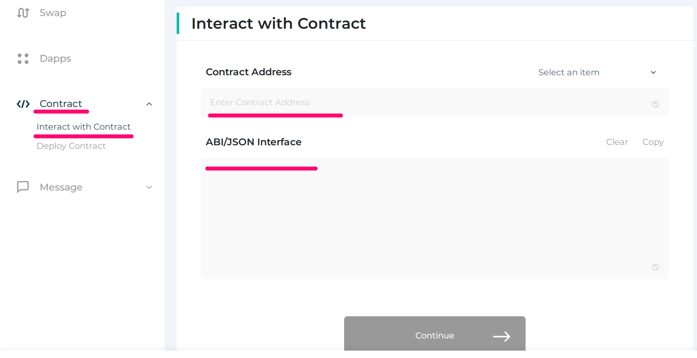
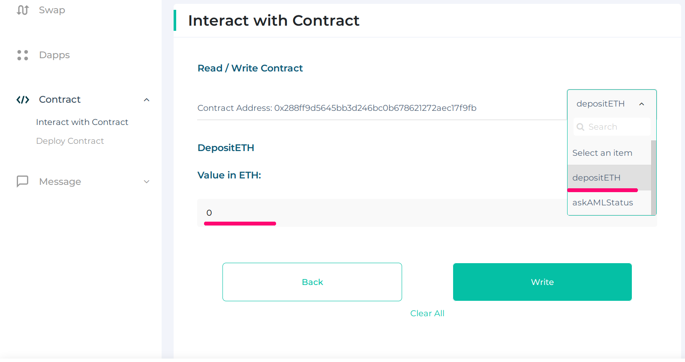
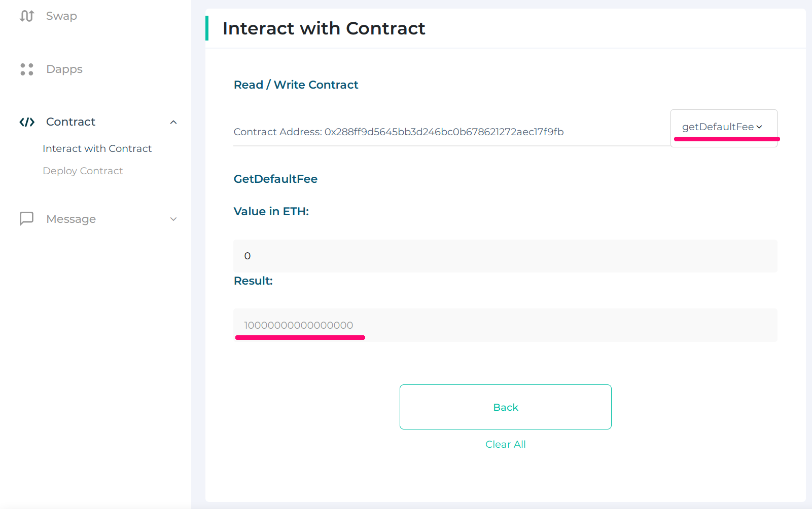
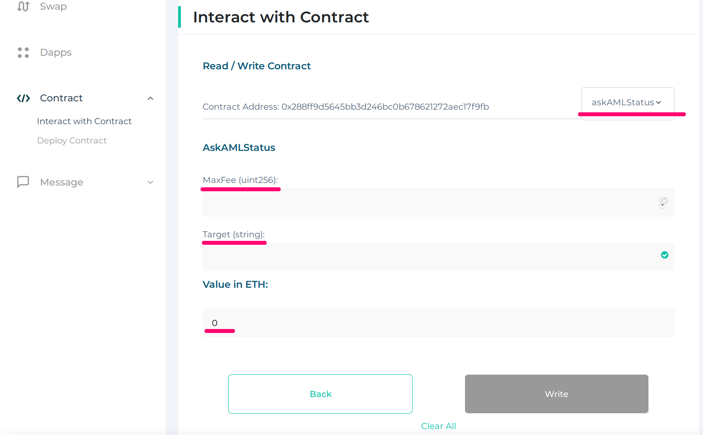
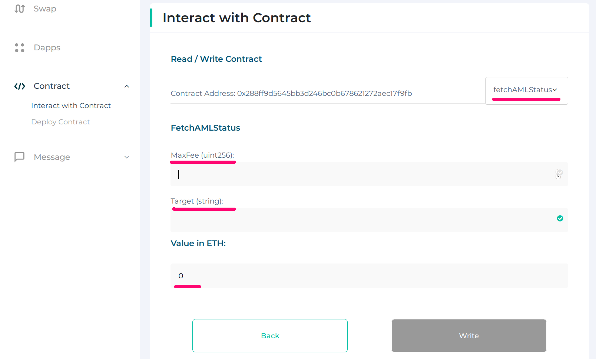

# How to interact with Coinfirm AML Oracles

## Using MEW

* enter the [MEW](https://www.myetherwallet.com) website
* create new or access existing wallet 
* add new contract to interact with, set provided `address` and `abi` to relevant placeholders 
* click `Continue`
* on the right side from contract address, choose 'depositETH' from drop-down menu and set desired amount to deposit (minimal fee for a report 0.001 ETH) 
* click `write` and continue with wallet you have signed in; If transaction executes successfully -- your balance will be increased;
* to get default fee choose `getDefaultFee` from drop down menu and copy `Result` value 
* next call `askAMLStatus` function, set `maxFee` to value of maximum fee intended to pay for report, has to be greater or equal `default fee` (result from previous point)
 set `target` to the address you want to request AML report generation for; ATTENTION set `Value in ETH field` to ZERO! 
  
* click `write` and continue with wallet you have signed in; After successful transaction, our platform will generate AML report for the address and set result into blockchain with special transaction. This process is asynchronous, hence client should wait some time;
* next step is to fetch aml status. Choose 'fetchAMLStatus' from drop-down menu and set target to the address you used in previous step. Click write and proceed with the wallet you have signed in;

  
 

 
